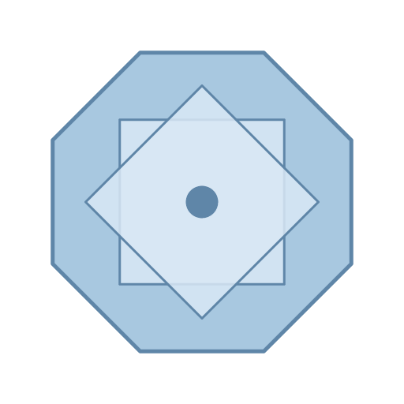

# Typechecker Zoo

This is a pet project of mine I've been working on for a while. We're going to create minimal implementations of the most successful static type systems of the last 50 years. This will involve making toy implementations of programming languages and the core typechecking algorithms. These obviously have evolved a lot over the years, so we'll start with the simple ones and proceed all the way up to modern dependent types. Basically a fun romp through half a century of programming language design.

We're going to implement them all in Rust for no particularly reason, other than Rust having a decent parser ecosystem and being easy to install. And I like the ironic synthesis of building pure functional languages in a language which is decidedly non-functional. It's a bit of a heaven-and-hell thing going on, and I'll leave it up to you to decide on the chirality of that metaphor.

This is going to be a more a fun weekend side project, rather than a formal introduction to these systems. If you want authoritative resources read [TAPL](https://www.cis.upenn.edu/~bcpierce/tapl/), [ATTAPL](https://www.cis.upenn.edu/~bcpierce/attapl/) and [PFPL](http://profs.sci.univr.it/~merro/files/harper.pdf) for the theory and proofs. And also read the primary sources for each typechecker which are linked in the [appendix](./appendices/bibliography.md).

While the textbooks and papers are great, they often focus on the theory in depth and don't cover the gritty details of how to actually implement these kind of typecheckers in real code, in terms of how to lay out the data structures, logic, abstract syntax trees, etc. So we're going for a fun implementation of the gory details of these systems that could be done in a weekend.

The examples are implemented in fairly idiomatic Rust with a full parser and test suite, using the usual compiler libraries such as [lalrpop](https://lalrpop.github.io/lalrpop/), [logos](https://logos.maciej.codes/), [ariadne](https://github.com/zesterer/ariadne), etc. They are obviously simplified and code golfed versions of the full implementations so that they can be easily understood and modified. But they should be a LOT easier to understand than trying to read production implementations. Parsing is also a solved problem, [cranelift](https://cranelift.dev) and [MLIR](https://www.stephendiehl.com/posts/mlir_introduction/) exist so I'm not really going to focus on either because that's increasingly something we offload to libraries.

The full source code is available here on Github under an MIT license:

- [**Github Source Code**](https://github.com/sdiehl/typechecker-zoo)
- [Build Instructions](https://github.com/sdiehl/typechecker-zoo/blob/main/README.md)

---

Since it's a typechecker "zoo", and we aim to put the "fun" in functional, each one is going to have an animal mascot. The six little critters we're going to build are:

[**Algorithm W**](./algorithm-w/lambda-calculus.html) _(775 lines of code)_

Robin Milner's classic Hindley-Milner type inference algorithm from _A Theory of Type Polymorphism in Programming_. A toy **polymorphic lambda calculus**.

[**System F**](./system-f/system-f.html) _(1090 lines of code)_

Second-order lambda calculus with parametric polymorphism using bidirectional type checking. A **Mini-OCaml**

An implementation of DK algorithm from _Complete and Easy Bidirectional Typechecking for Higher-rank Polymorphism_ by Dunfield and Krishnaswami.

[**System Fω**](./system-f-omega/system-f-omega.html) _(3196 lines of code)_

Complete implementation of System Fω with higher-kinded types, bidirectional type checking, existential type variables, polymorphic constructor applications, pattern matching, and datatypes. A **Haskell-lite**.

Uses the method of _A Mechanical Formalization of Higher-Ranked Polymorphic Type Inference_ by Zhao et al.

[**Calculus of Constructions**](./coc/calculus-of-constructions.html) _(6000 lines of code)_

The Calculus of Constructions with a countable hierarchy of non-cumulative universes and inductive types. A **teeny Lean-inspired dependent type checker**.

Uses a bidirectional dependent typechecker outlined in _A Universe Polymorphic Type System_ by Vladimir Voevodsky.

[**Row Polymorphism**](./row-poly/row-polymorphism.html) _(782 lines of code)_

Extensible records with scoped labels, where duplicate labels are allowed and selection always picks the leftmost occurrence. A **structurally-typed record calculus**.

Implements a calculus of extensible records with scoped labels.

[**Row Effects**](./row-effects/row-effects.html) _(923 lines of code)_

Algebraic effects and handlers built on the same scoped-label row machinery, with effect-annotated arrows and a syntactic value restriction. A **tiny effect calculus**.

Follows a presentation of row-polymorphic effect types, with handlers in the style of Plotkin and Pretnar's _Handlers of Algebraic Effects_.

This is an MIT licensed project and just something I do as a hobby in my spare time, so if you notice a typo in the prose or code open up a [pull request on Github](https://github.com/sdiehl/typechecker-zoo) and I will be very thankful!
